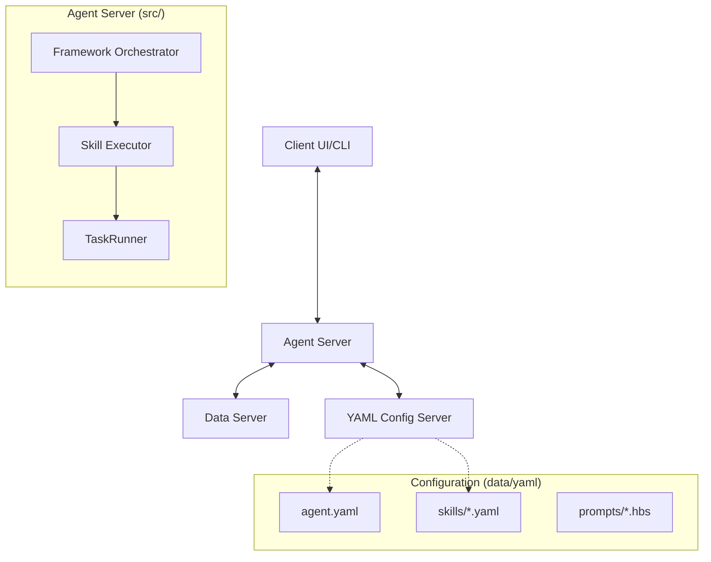

# LawAgent-JS 系统设计文档 (System Design)

> **版本**: 3.0 (Configuration-Driven Framework)
> **日期**: 2026-01-28
> **状态**: Active

## 1. 核心概念 (Core Concepts)

LawAgent-JS 是一个**配置驱动的通用智能体框架**。它将核心执行逻辑与具体业务定义完全解耦，允许通过 YAML 配置文件定义智能体 (Agent)、技能 (Skill) 和工作流 (Workflow)，而无需修改底层代码。

### 核心特性
*   **配置驱动 (Configuration Driven)**: 所有的业务逻辑（Prompt、流程、输入输出）均在地 `data/yaml` 中定义。
*   **多智能体支持 (Multi-Agent)**: 框架支持加载多个 Agent（如 LawAgent, MedicalAgent），每个 Agent 拥有独立的技能集。
*   **工作流引擎 (TaskRunner)**: 支持定义包含多个顺次 LLM 调用或工具操作的复杂技能。
*   **标准化上下文**: 上下文 (Context) 由 Data Server 统一管理，支持断点续传和多端协同。

---

## 2. 系统架构 (Architecture)

系统采用典型的微服务化分层架构：



### 2.1 核心组件

#### Agent Framework (`src/framework/`)
系统的核心引擎，不包含任何业务代码。
*   **FrameworkOrchestrator**: 负责解析用户指令，加载对应的 Agent 配置，并生成执行计划。
*   **SkillExecutor**: 通用技能执行器，支持 `llm`, `workflow`, `client_api` 等多种执行模式。
*   **TaskRunner**: 负责执行由 YAML 定义的多步工作流，管理步骤间的变量传递。
*   **PromptEngine**: 基于 Handlebars 的 Prompt 渲染引擎，支持动态上下文注入。

#### Servers
*   **Agent Server** (`src/agent_server`): 托管 Framework，暴露 REST API 接收任务。
*   **Data Server** (`src/data_server`): 负责案件数据的持久化存储和文件管理。
*   **YAML Server** (`src/yaml_server`): 负责配置文件的读取和热加载。


---

## 3. 业务定义 (Business Definition)

业务逻辑完全由 `data/yaml` 目录下的配置文件决定。

### 3.1 目录结构
```text
data/yaml/law_agent/
├── agent.yaml           # Agent 元数据 (名称, 版本, 描述)
├── skills/              # 技能定义
│   ├── s01_party_profiling.yaml
│   ├── s08_judicial_reasoning.yaml
│   └── ...
├── prompts/             # Prompt 模板 (Handlebars)
│   ├── party_profiling.hbs
│   ├── judicial_analysis.hbs
│   └── judicial_drafting.hbs
└── types/               # 文档类型定义
    └── document_types.yaml
```

### 3.2 技能定义 (Skill Manifest)
技能是 Agent 能力的原子单元。支持两种主要模式：

#### A. 单步 LLM 模式 (`execution_type: llm`)
最简单的模式，渲染一个 Prompt 并调用 LLM。
```yaml
id: "Skill_当事人提取"
execution_type: "llm"
prompt: "law_agent/prompts/party_profiling"
inputs:
  - name: "docs"
    description: "起诉状与答辩状"
outputs:
  - id: "D01"
    filename_template: "D01_当事人信息.json"
```

#### B. 工作流模式 (`execution_type: workflow`)
支持多步骤顺次执行，上一步的输出可作为下一步的输入。
```yaml
id: "Skill_裁判说理"
execution_type: "workflow"
workflow:
  steps:
    - id: "step1"
      type: "llm"
      prompt: "law_agent/prompts/judicial_analysis"
      outputs: [{ id: "analysis" }]
    
    - id: "step2"
      type: "llm"
      prompt: "law_agent/prompts/judicial_drafting"
      inputs:
        - name: "analysis"
          ref: "steps.step1.analysis"  # 引用上一步结果
```

---

## 4. 运行机制 (Execution Mechanism)

1.  **任务接收**: Agent Server 接收 `POST /agent/run` 请求。
2.  **配置加载**: Orchestrator 通过 Loader 从 YAML Server 拉取 Agent 定义。
3.  **规划 (Planning)**:
    *   Orchestrator 调用 LLM (基于 `analyser.hbs`) 分析用户意图。
    *   生成包含 Skill ID 和所需文件 ID 的执行计划 (JSON)。
4.  **解析 (Resolution)**:
    *   框架将计划中的文件 ID (如 "R01") 解析为物理文件内容。
5.  **执行 (Execution)**:
    *   **LLM Skill**: 渲染 Prompt -> LLM -> 解析 JSON -> 写入结果。
    *   **Workflow Skill**: 初始化 WorkflowContext -> 依次执行 Steps -> 汇总结果。
6.  **反馈**: 结果写入 Data Server，并通过 Callback 通知 Client。

---

## 5. 开发指南

### 添加新技能
1.  在 `skills/` 下创建新的 `.yaml` 文件定义元数据。
2.  在 `prompts/` 下创建对应的 `.hbs` 模板。
3.  无需重启 Server，下一次请求即可生效（部分缓存可能需要刷新）。

### 修改业务逻辑
直接修改 `prompts/` 下的模板文件即可调整 AI 的行为，无需编译代码。

---

## 6. API 接口

详细 API 定义请参考：
*   [Agent Server API](./api_agent_server.md)
*   [Data Server API](./api_data_server.md)
*   [YAML Server API](./api_yaml_server.md)
